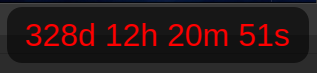

# Exam Countdown Overlay ⏳

A simple, always-on-top overlay application to track the time remaining until your Sri Lankan G.C.E. Advanced Level (A/L) exam on August 10, 2026. This application is built with Python and PyQt6.



## ✨ Features

  * **Always-on-Top**: The countdown window stays on top of all other applications, so it's always visible.
  * **Minimalist Design**: A clean, modern, and frameless design with rounded borders and transparent background.
  * **Customizable**: Easily change the exam date, font, and display location.
  * **Multi-Monitor Support**: The application can be configured to appear on a specific monitor.
  * **Fixed Position**: The countdown box stays in a fixed position on your screen and cannot be moved.

## 🚀 Installation & Usage

### Prerequisites

  * Python 3.6 or higher
  * A stable internet connection

### Windows

1.  **Download the executable** from the releases section of this repository.
2.  **Double-click** the `countdown.exe` file to run the application.

### Linux

1.  **Download the AppImage** from the releases section of this repository.
2.  **Make it executable** by right-clicking the file, going to **Properties** -\> **Permissions**, and checking "Allow executing file as a program." You can also do this from the terminal:
    ```bash
    chmod +x countdown.AppImage
    ```
3.  **Double-click** the AppImage to run it.

## ⚙️ How to Configure

The countdown is currently set for the **2026/08/10** A/L exam date and is configured to appear on the **first display**. To customize these settings, you need to edit the `countdown.py` script.

1.  **Open the `countdown.py` file** in a text editor.
2.  Locate the `if __name__ == '__main__':` block at the bottom of the file.

<!-- end list -->

```python
if __name__ == '__main__':
    app = QApplication(sys.argv)
    
    # Your A/L Exam Date: August 10, 2026
    sri_lankan_al_exam_date = QDate(2026, 8, 10)
    
    # To use the second display, pass 2 as the argument
    # To use the first display, pass 1
    countdown = CountdownOverlay(sri_lankan_al_exam_date, display_number=1)
    sys.exit(app.exec())
```

  * To change the exam date, modify the `QDate(2026, 8, 10)` part. For example, for December 31, 2025, you would write `QDate(2025, 12, 31)`.
  * To change the display, change the `display_number` argument. Set it to `1` for the main screen or `2` for a second screen.

### Running from Source

If you prefer to run the script directly, you'll need to install the necessary libraries.

1.  **Clone this repository** (or download the files).
2.  **Create and activate a virtual environment** to avoid system conflicts.
    ```bash
    python3 -m venv .venv
    source .venv/bin/activate  # On Windows: .venv\Scripts\activate
    ```
3.  **Install PyQt6**.
    ```bash
    pip install PyQt6
    ```
4.  **Run the script**.
    ```bash
    python countdown.py
    ```

## 📜 License

This project is open-source and available under the [MIT License](https://opensource.org/licenses/MIT).
